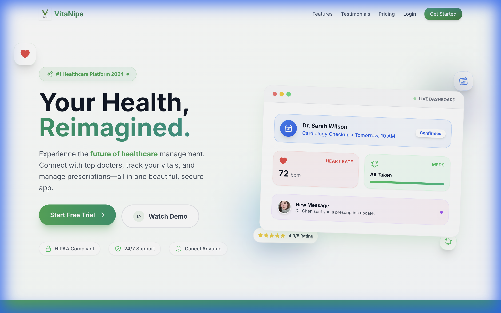

# VitaNips Frontend



VitaNips is a comprehensive health management application designed to empower users to take control of their well-being. This frontend repository contains the user interface for the VitaNips platform, built with modern web technologies to ensure a fast, responsive, and accessible experience.

## 🚀 Features

VitaNips offers a wide range of features to support your health journey:

*   **Dashboard**: A centralized hub for your health overview, upcoming appointments, and daily tasks.
*   **Appointments**: Easy scheduling and management of doctor appointments, including video call integration.
*   **Health Tracking**: Log and monitor vital stats, sleep, water intake, exercise, and nutrition.
*   **Medical Records**: Secure storage and access to your medical documents, prescriptions, and vaccination history.
*   **Doctor Search**: Find and connect with healthcare professionals based on specialty and location.
*   **Emergency Support**: Quick access to emergency contacts and services.
*   **Family Health**: Manage health profiles for family members.
*   **Reminders**: Automated medication and appointment reminders.

## 🛠️ Tech Stack

This project is built using a robust and modern technology stack:

*   **Framework**: [React](https://react.dev/) (v19)
*   **Build Tool**: [Vite](https://vitejs.dev/)
*   **Language**: [TypeScript](https://www.typescriptlang.org/)
*   **Styling**: [Tailwind CSS](https://tailwindcss.com/)
*   **State Management & Data Fetching**: [TanStack Query (React Query)](https://tanstack.com/query/latest)
*   **Routing**: [React Router](https://reactrouter.com/)
*   **Forms**: [React Hook Form](https://react-hook-form.com/) + [Zod](https://zod.dev/)
*   **Maps**: [Leaflet](https://leafletjs.com/) / [React Leaflet](https://react-leaflet.js.org/)
*   **Charts**: [Recharts](https://recharts.org/)
*   **Authentication**: Firebase Auth
*   **Internationalization**: i18next

## 📦 Installation & Getting Started

Follow these steps to set up the project locally:

1.  **Clone the repository:**
    ```bash
    git clone <repository-url>
    cd VitaNips-Frontend-Dev
    ```

2.  **Install dependencies:**
    ```bash
    npm install
    ```

3.  **Environment Setup:**
    Create a `.env` file in the root directory and configure your environment variables (Firebase config, API endpoints, etc.).

4.  **Run the development server:**
    ```bash
    npm run dev
    ```
    The application will be available at `http://localhost:5173` (or the port shown in your terminal).

5.  **Build for production:**
    ```bash
    npm run build
    ```

## 🧪 Testing

Run the test suite to ensure everything is working correctly:

```bash
npm run test
```

## 📄 License

This project is licensed under the MIT License.
